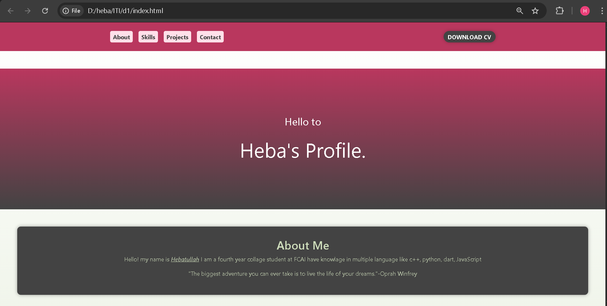
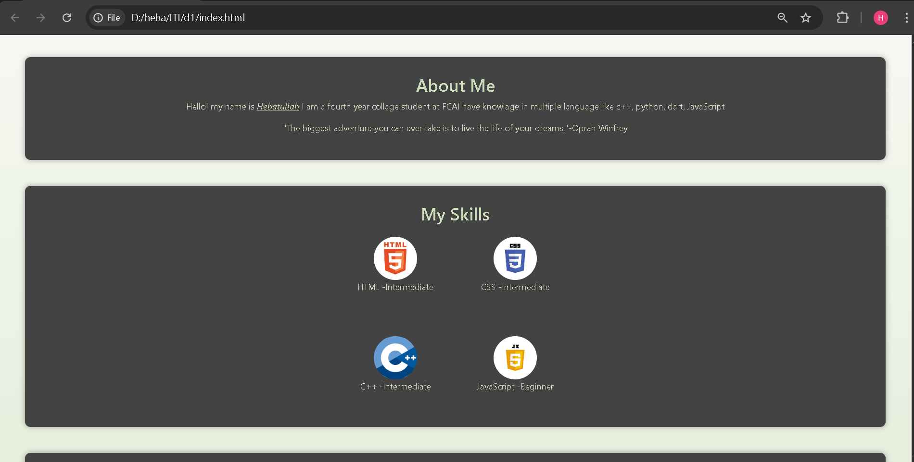
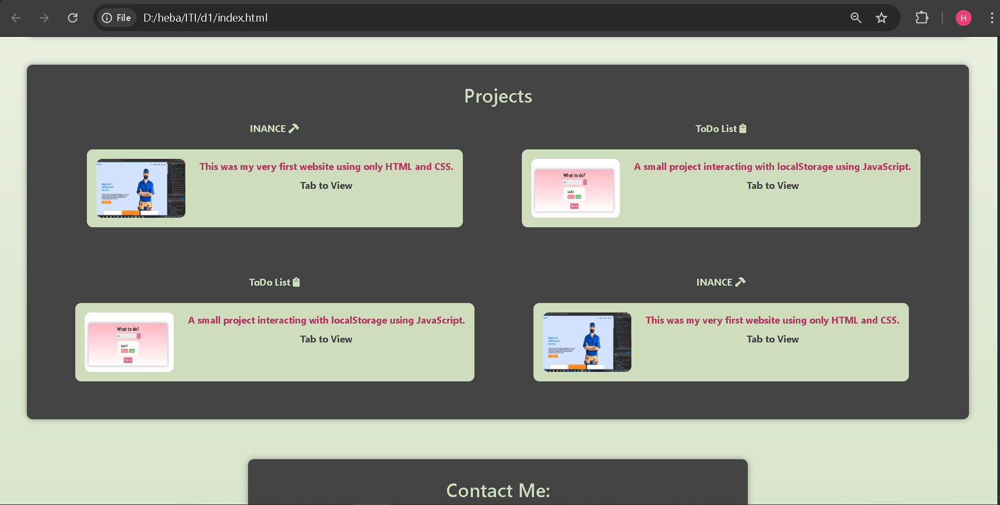
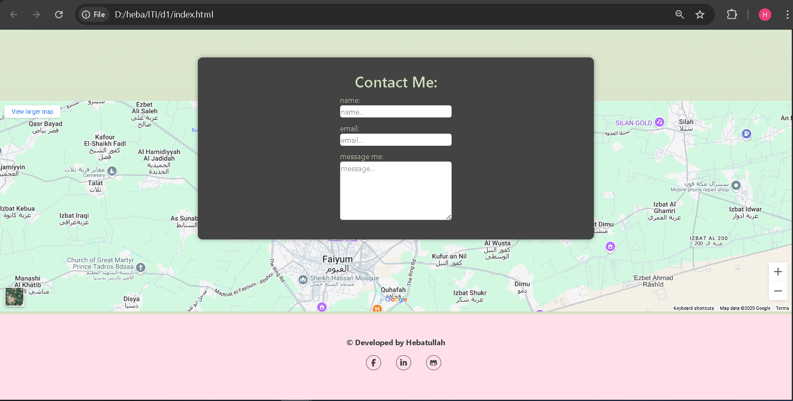

# 🌟 Hebatullah Khaled's Portfolio

Welcome to my personal portfolio website!  
This site is a clean and responsive one-page portfolio built with **HTML** and **CSS**, designed to reflect my passion for front-end development. It presents who I am, what I do, and showcases some of the projects I've built — all in a simple, user-friendly layout.

---

## ✨ Features

- 🎯 Clean, modern, and professional design
- 🖥️ Fully responsive layout (works on all devices)
- 💼 Sections: About Me, Skills, Projects, Contact
- 🔗 Smooth scrolling for a better user experience
- 📄 Downloadable CV button
- 🧠 Visual skill tags with hover effects
- 💬 Contact form with input validation

---

## 🛠️ Technologies Used

- HTML5
- CSS3
- Git & GitHub for version control

---

## 📸 Screenshots

> All screenshots are stored in the `img/` folder:

| Preview 1 | Preview 2 |
|-----------|-----------|
|  |  |

| Preview 3 | Preview 4 |
|-----------|-----------|
|  |  |

---

## 📬 Contact

- 📧 Email: **hebakhaledsalem233@gmail.com**  
- 💼 LinkedIn: [https://www.linkedin.com/in/heba-allah-khaled-salem-464628361](https://www.linkedin.com/in/heba-allah-khaled-salem-464628361)

Thank you for visiting! 😊
